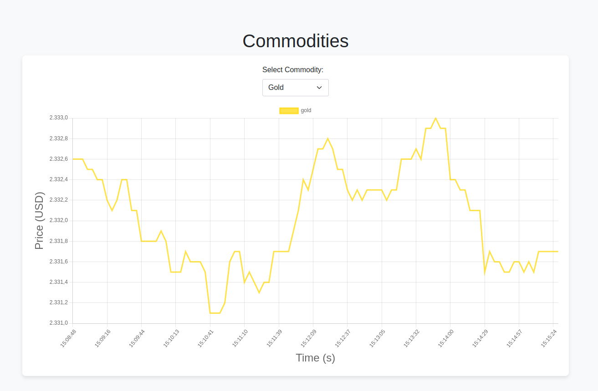

# commodities-prices-dashboard

This project has been made for the college subject SSC0158 - Computação em Nuvem e Arquitetura Orientadas a Serviços (2024). For this reason, our group made a Cloud Application which we use the Kafka to build a real-time streaming data. In this scenario, the theme of this project is the commoddities price.
 
This project was developed for the college course `SSC0158 - Computação em Nuvem e Arquitetura Orientada a Serviços (2024)`. Our group created a cloud application using Kafka to build a real-time streaming data pipeline focused on commodity prices.

## Group members:
* Guilherme Mafra da Costa - 11272015
* João Alexandro Ferraz - 11800441
* Matheus Baptistella - 11223117

## Project
In this project, we have the producer being responsible to receive the current price of a commodity from a API and send it to the Kafka. Then, the consumer receive the values from the Kafka and store this data into a MongoDB database. At the end, the frontend application plot a real time graph with a time series that show the values stored in the database.  
In this project, a producer retrieves current commodity prices from an API and sends this data to Kafka. The consumer then receives the data from Kafka and stores it in a MongoDB database. Finally, the frontend application displays a real-time graph with a time series showing the stored values.

We have implemented a Docker Compose setup to containerize this application. You can run the project using the following command:

```
sudo docker-compose build && sudo docker-compose up
```

After this, you can acess the web site in the localhost:5053.

We have implemented a docker-compose to make this project a containerized application. So, you can run this project through the docker-compose up.

An exemple of our web application can be seen in the image below:


